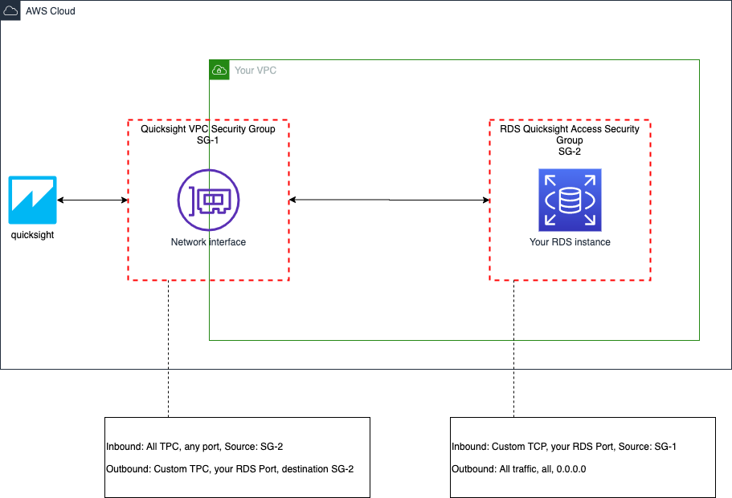

# Connect quicksight to an RDS instance in a VPC

I had a lot of trouble trying to connect AWS quicksight with an RDS following this guide: https://docs.aws.amazon.com/quicksight/latest/user/enabling-access-rds.html

So here is my own guide for the next one trying to get the security groups in place. I still reccommend to read the guide as I will not explain some basics here.

### Goal
What we want to achieve is connecting quicksight to an RDS instance in a VPC without giving it public access.

### Preconditions
So we need a user with enough permissions to modify quicksight, rds and security groups.

### Overview Network
The diagram shows what we want to achieve:

### Steps
These are the steps to achieve:
1. Create a security group *SG-1* "quicksight-vpc" to allow traffic incoming from quicksight to the RDS instance and outgoing traffic from the RDS instance to quicksight in two steps 1 and 3 as:
* Inbound rules: All TCP,	TCP,	0 - 65535,	-
* Outbound rules: Custom TCP,	TCP,	your RDS PORT, -

2. Create *SG-2* "Quicksight-access" to allow incoming traffic from *SG-1* to your RDS instance as:
* Inbound rules: Custom TCP,	TCP,	your RDS port,	SG-1
* Outbound rules: All traffic,	All,	All,	0.0.0.0/0

3. Modify *SG-1* to accept connections in both directions from *SG-2* as:
* Inbound rules: All TCP,	TCP,	0 - 65535,	*SG-2*
* Outbound rules: Custom TCP,	TCP,	your RDS PORT, *SG-2*

4. Add *SG-2* to your RDS instance security groups

5. Go to quicksights and create a VPC connection with the ID SG-1 and any subnet group which is used by your RDS instance See: (https://docs.aws.amazon.com/quicksight/latest/user/vpc-creating-a-connection-in-quicksight.html)

6. After this you can check that a network interface was created with SG-1 allowing the desired incoming and outgoing traffic 

7. Go to quicksights > data source and use the created VPC connection to reach your RDS instance

To connect futher RDS instances to quicksight we just need to add SG-2 to the instance security groups and modify SG-1 port(s)

### Conclusion
This way we created a way to connect quicksight to our RDS instance without making it public. 
I still have to find out how to implement this in CDK. 

I hope this helps you!
